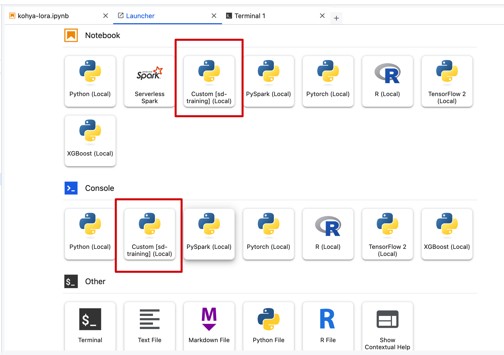
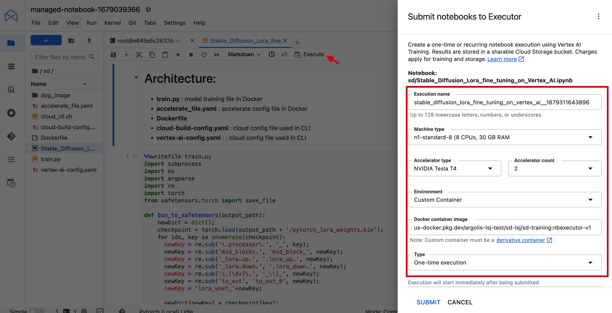
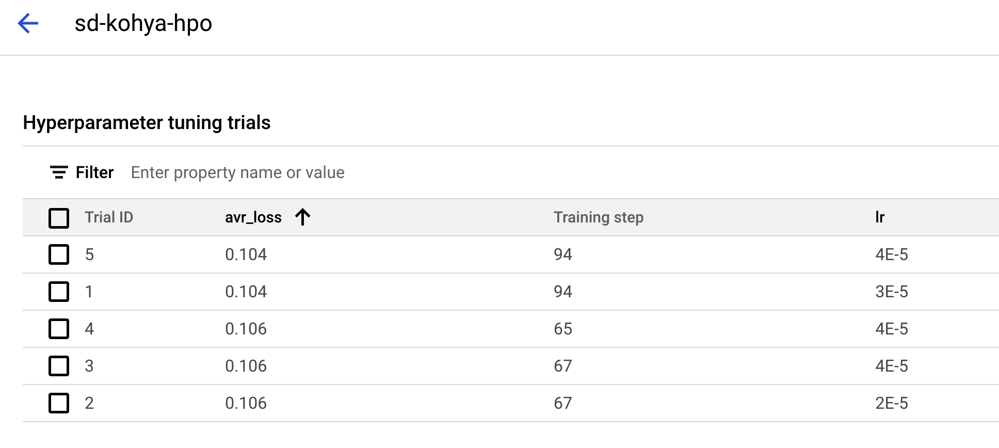

# **Stable Diffusion Fine-tuning on Google Cloud Quick Start Guide**

This guide gives simple steps for stable diffusion users to fine-tune stable diffusion on Google Cloud Vertex AI. Two options are provided, one is Vertex AI custom training service, the other is Workbench. User can just follow the step have your stable diffusion model training.

* [Introduction](#introduction)
* [Build Image](#build-image)
* [Vertex AI custom training](#vertex-ai-custom-training)
* [Vertex AI Workbench](#vertex-ai-workbench)
* [Vertex AI hyperparameter tuning](#vertex-ai-hp-tuning)

## Introduction
   [Vertex AI](https://cloud.google.com/vertex-ai/docs/start/introduction-unified-platform) is a machine learning (ML) platform that lets you train and deploy ML models and AI applications. Vertex AI combines data engineering, data science, and ML engineering workflows, enabling your teams to collaborate using a common toolset.

   [Diffusers](https://github.com/huggingface/diffusers) is the go-to library for state-of-the-art pretrained diffusion models for generating images, audio, and even 3D structures of molecules. It provides diffusion model's training, inference on GPU and TPU.

   [PEFT](https://github.com/huggingface/peft) **Parameter-Efficient Fine-Tuning** methods enable efficient adaptation of pre-trained language models (PLMs) to various downstream applications without fine-tuning all the model's parameters. Supported methods of LoRA, Prompt Tuning, P Tuning, Prefix Tuning.

   [Kohya-ss](https://github.com/kohya-ss/sd-scripts) is a Github repo contributed by Japanese developers, implementing Dreambooth fine-tuning, native fine-tuning, and Lora fine-tuning. It's also based on an old version of Diffusers library, but exposing more arguments for adjusting.

   In the project, we provide three implementations, Diffusers library and Kohya implementation, custom training on Vertex AI. All implementations are in two dockerfiles, Diffusers and PEFT are in *Diffusers* folder, Kohya-ss is in *Kohya-lora* folder. The reason that two folders are seperated is they are based on different versions of Diffusers library, which may be in conflict.
   - Diffusers **Dreambooth** training on GPU on Vertex AI
   - Diffusers **Dreambooth Lora** training on GPU on Vertex AI
   - Diffusers **Text to Image(Native)** training on GPU on Vertex AI
   - Diffusers **Text to Image(Native) Lora** training on GPU on Vertex AI
   - Peft **Dreambooth Lora** training on GPU on Vertex AI
   - Kohya-ss **Dreambooth Lora** training on GPU on Vertex AI
   - Kohya-ss **Native Lora** training on GPU on Vertex AI

   This project also uses Cloud Build to quickly build up a docker image for training.

   Customer can just use [Huggingface pre-trained Stable Diffusion model](https://huggingface.co/runwayml/stable-diffusion-v1-5) as base model or prepare the stable diffusion model by yourself.

## Build Image

We provide two image options: **Diffusers** and **Kohya**, each docker image can be leveraged for custom training, Workbench training and executor.
You can use the cloud shell as the run time to do below steps.

### Before you begin
1. Make sure you have an available GCP project for your deployment

2. Enable the required service API using [Cloud Shell](https://cloud.google.com/shell/docs/run-gcloud-commands)

```
gcloud services enable artifactregistry.googleapis.com container.googleapis.com aiplatform.googleapis.com
```

2. Make sure the Vertex AI service account (that is **Compute Engine default service account**) has enough access to GCS

3. Get GPU quota in your GCP project

### Create an Cloud Artifact as docker repo

```
BUILD_REGIST=<replace this with your preferred Artifacts repo name>

gcloud artifacts repositories create ${BUILD_REGIST} --repository-format=docker \
--location=us-central1

gcloud auth configure-docker us-central1-docker.pkg.dev
```
### Build Stable Diffusion image using Cloud Build

1. Change to *Diffusers* or *Kohya-lora* folder 

2. Config project id and artifact repo id and image name in *cloud-build-config.yaml*

3. Build the image using Cloud Build, the command can be found in *cloud-cli.sh*

```
gcloud builds submit --config cloud-build-config.yaml .
```

## Vertex AI Custom Training

Vertex AI provides a [managed training service](https://cloud.google.com/vertex-ai/docs/training/overview) that enables you to operationalize large scale model training. You can use Vertex AI to run distributed training applications based on any machine learning (ML) framework (Tensorflow, Pytorch, etc.) on Google Cloud infrastructure. 

### Fine-tune stable diffusion model on Vertex AI customer training

1. Upload training images to Cloud Storage, users can just use the dog images in this repo as an example. Each training method has its own data format requirements.
- Diffusers and PEFT Dreambooth, and Dreambooth Lora: images in the folder
- Diffusers Text-to-Image, and Text-to-Image Lora: images and metadata.jsonl in the folder. The metadata.jsonl file can be referenced in *Diffusers* folder.
```
|-- folder
|---- metadata.jsonl
|---- image.jpeg
```

- Kohya-ss: sub-folder with name of [num_repeat]_[prompt_name], e.g. 10_aki.

```
|-- folder
|---- sub-folder (10_aki)
|------- image.jpeg
```
```
gsutil cp -r dog_images gs://bucket_name/dog_images
```

2. [Optional] Upload your customized base model to Cloud Storage

3. Config the prepared image name in *vertex-config.yaml*, in the sample config, we just use a n1-stanard-8 machine with one v100 or two T4 GPU. If you want to enable multiple A100 training, configure it like below. This project can automatically detects the GPU numbers and configure multi-GPU training.

```
machineSpec:
    machineType: n1-standard-8
    acceleratorType: NVIDIA_TESLA_A100
    acceleratorCount: 2
```

4. Submit custom training job with arguments input.

 The **command** will work as the entrypoint, add it or not depends on if Entrypoint is added in Dockerfile.
 
 * If **ENTRYPOINT ["python3", "-m", "train_kohya"]** is added in Dockerfile, then **command** is no need to add in the cloud command. But this docker image will be not working in Vertex AI Notebook.

* If no **Entrypoint** in Dockerfile, then custom training command need this **command** parameters, like **--command="python3,train_kohya.py"**. But this docker image can be also used in Notebook Executor or Notebook loading custom image.


And the parameter **args** can be configured like below:
    * The model name can be Huggingface repo id, or Cloud Storage path, like */gcs/bucket_name/model_folder*
    * The input_storage and output_storage should be Cloud Storage path like */gcs/bucket_name/input_or_output_folder*
    * Prompt can be like "a photo of somebody or some special things
    * Other arguments can be referenced from python file.
  
```
gcloud ai custom-jobs create \
  --region=us-central1 \
  --display-name=${JOB_NAME} \
  --config=vertex-config.yaml \
  --args="--model_name=runwayml/stable-diffusion-v1-5,--input_storage=/gcs/bucket_name/input_dog,--output_storage=/gcs/bucket_name/dog_lora_output,--prompt=a photo of sks dog" \
  --command="python3,train.py"

```
5. The generated model will be saved in output_storage path, *bin file*, *safetensors file*, or Diffusers format. The training logs are also in the event folder.

- Safetensors file is for Automatic1111 WebUI.
- The *pytorch_lora_weights.bin* file is model in original Stable Diffusion format.
- And multiple folders(vae, feature_extractor, etc.) are Diffusers format.

### Check the outputs in Cloud Storage
After sumit training job to Vertex AI, you can monitor its status in Cloud UI. 


### Copy safetensors model to File Store
We also add Filestore support. If you have created a Filestore, and configure the network as [instructed](https://cloud.google.com/vertex-ai/docs/training/train-nfs-share). In custom training, the model can also be saved to File Store. In this project, the File Store's share name is **vol1**, this is the name when you create the FileStore. And you can choose mount path, prefix with */mnt/nfs*, e.g. */mnt/nfs/model_repo*. In the vertex-config.yaml file, you just copy the share name and input your mount path. And when executing the code, you should pass the arguments of **nfs_mnt_dir** with the same directory name. 


In Diffusers folder, *train_wo_nfs.py* does not include NFS function, and regular *train.py* contains the NFS function. You can use *Vertex-config-nfs.yaml* and submit training job with **save_nfs=True** arguments to enable models saving to File Store, and **nfs_mnt_dir** for mount directory.

And if argument **save_nfs_only=True** is selected, then it only executes copy models task from GCS (*output_storage*) to File Store(e.g. *"/mnt/nfs/model_repo"*), so **output_storage** also needs to be selected in this mode. Other arguments are not used.

In Kohya-lora folder, the same.

### File architecture

```
|-- Diffusers
|------ train.py #model training file in Docker
|------ train_wo_nfs.py #model training file but no nfs function
|------ Dockerfile
|------ cloud-build-config.yaml #cloud config file used in CLI
|------ vertex-config.yaml  #Vertex AI custom training config file used in CLI
|------ vertex-config-nfs.yaml  #Vertex AI custom training and nfs config
|------ cloud-cli.sh #sample cloud command
|------ metadata.jsonl #metadata file for Text-to-Image training
|
|-- Kohya-lora
|------ train_kohya.py #model training file in Docker
|------ Dockerfile_kohya
|------ cloud-build-config-kohya.yaml #cloud config file used in CLI
|------ vertex-config-nfs.yaml  #Vertex AI custom training and nfs config
|------ vertex-config.yaml  #Vertex AI custom training config file used in CLI
|------ cloud-cli.sh #sample cloud command
|
|-- dog_images #sample training images
```

## Vertex AI Workbench

[Vertex AI Workbench managed notebooks instances](https://cloud.google.com/vertex-ai/docs/workbench/managed/introduction) are Google-managed environments with integrations and capabilities that help you set up and work in an end-to-end Jupyter notebook-based production environment.

The managed instance supports adding a custom image as kernel, that you can run your notebook on. It's easy for data scientist to interactively change codes and observe performance, with a pre-built and fixed environment.

The executor lets you submit a notebook (ipynb) file from Workbech, to run on Vertex AI custom training. So it's convenient for codes and parameters fine-tuning, and computing cost saving.

### Creare managed instance

Create a managed instance in Vertex AI Workbench. If you want to load custom image, make sure to add this custom image when provisioning the instance. You can just use the docker image built in custom training job (with no Entrypoint). It's a uniform image, covering all scenarios. If your docker image includes an Entrypoint, then Workbench may fail to execute the code in the image.




### Fine-tune stable diffusion model in Vertex AI Workbench

Option one is you just fine tune the model in page of notebook. The environment is provided by the custom image, and a GPU needs to be provisioned for training.

You can reference the notebook of [kohya-lora.ipynb](./Workbench/kohya-lora.ipynb). And note that docker image only provides a hosting environment, so the code needs to be downloaded again, and training dataset needs to be uploaded to notebook. And after training, the model is saved in notebook. You can upload the models to Cloud Storage, and transfer the models to Filestore using a custom job, just as the sample notebook shows.

### Fine-tune stable diffusion model in Vertex AI Workbench Executor

Option two is you submit the training task from notebook to custom training service via Executor. There are several advantages.
1. You can submit multiple tasks at the same time, no interrupting the notebook environment and occupying notebook's resources. 
2. The custom training task will directly run the code in Jupyter notebook with no need of refining to python script. 
3. Connect to GCS  for data and files reading and writing just like local folder. No need to upload data to notebook, or refine the code to adjust to GCS interface.

So the executor process is as below. You can also reference the sample ntoebook [diffusers_nbexecutor.ipynb](./Workbench/diffusers_nbexecutor.ipynb)

1. Upload training images to Cloud Storage

2. [Optional] Upload your customized base model to Cloud Storage

3. Modify code in workbench notebook, using *diffusers_nbexecutor.ipynb* as a sample.

4. Start an executor job in Workbench

Click **executor** buttor in Workbench notebook, and configure machine size and container name in the pop-out window.



After clicking Submit, it will start a custom training job, run the notebook in the selected container.

5. Check the outputs in Cloud Storage

The job status can be monitored in Workbench executor tab. Note that in this mode, we cannot configure NFS mounts.


When finished, you can get the fine-tuned model in Cloud Storage output folder. 
  
* The *pytorch_lora_weights.bin* file is model in original diffusers format, while *pytorch_lora_weights.safetensors* is converted from .bin file, userd for WebUI.
* The training logs are also in the event folder.

## Vertex AI HP Tuning

[Hyperparameter tuning](https://cloud.google.com/vertex-ai/docs/training/hyperparameter-tuning-overview) takes advantage of the processing infrastructure of Google Cloud to test different hyperparameter configurations when training your model. It can give you optimized values for hyperparameters, which maximizes your model's predictive accuracy.

We also demonstrated how to leverage Vertex AI hp-tuning in custom training job.

The demo is in *hpo* folder. 
- One demo is to hp-tune learning rate of kohya's lora method. For kohya-lora, the modification is mainly in *train_network.py*, which is from lora-scripts' source code. We add loss reporting functions to report the loss and global steps to hp-tuning service(with **cloudml-hypertune** package). And tuned target is learning rate, and tuned metrics is to minumize the average loss, which can be reference in *vertex-ai-config-hpo.yaml* file.
- The other demo is to hp-tune learning rate of diffusers' dreambooth method. the modification is mainly in *train_dreambooth.py*, which is from diffusers' source code. We add loss reporting functions to report the loss and global steps to hp-tuning service. And tuned target is learning rate, and tuned metrics is to minumize the loss, which can be reference in *vertex-ai-config-hpo.yaml* file.

When submit the job with **"gcloud ai hp-tuning-jobs create"** command, you can monitor the progress in cloud console. You can see for each learning rate selection, what's the minimum average loss, and what's its step. This makes users choose the best learning rate.



Then you can configure this learning rate in a custom training job to acquire best trained model.
