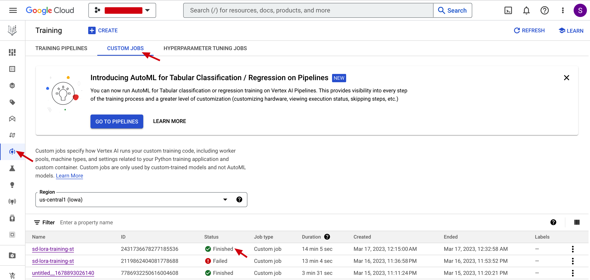

# **Stable Diffusion在Google Cloud上微调快速入门指南**

本指南为stable diffusion用户提供了在 Google Cloud Vertex AI 上微调stable diffusion的简单步骤，提供了两种选择，一种是Vertex AI定制训练服务，另一种是Workbench。用户可以按照步骤进行stable diffusion模型训练。

* [介绍](#介绍)
* [构建镜像](#构建镜像)
* [Vertex AI定制化训练服务](#Vertex_AI_定制化训练服务)
* [Vertex AI Workbench](#Vertex_AI_Workbench)

## 介绍
[Vertex AI](https://cloud.google.com/vertex-ai/docs/start/introduction-unified-platform)是一个机器学习 (ML) 平台，可让您训练和部署 ML 模型和 AI 应用程序。 Vertex AI 结合了数据工程、数据科学和 ML 工程工作流程，使您的团队能够使用通用工具集进行协作。

[Diffusers](https://github.com/huggingface/diffusers)是最先进的预训练diffusion模型的首选库，用于生成图像、音频，甚至分子的 3D 结构。它提供diffusion模型在 GPU 和 TPU 上的训练、推理。

[PEFT](https://github.com/huggingface/peft) **Parameter-Efficient Fine-Tuning** 方法可以使预训练语言模型 (PLM) 有效地适应各种下游应用程序，而无需微调所有模型的参数，支持LoRA、Prompt Tuning、P Tuning、Prefix Tuning等方法。

[Kohya-ss](https://github.com/kohya-ss/sd-scripts)是日本开发者贡献的Github repo，实现了Dreambooth微调、Text-to-image微调、Lora微调。它也基于旧版本的 Diffusers 库，但暴露了更多参数以进行调整。

在该项目中，我们提供了三个实现，Diffusers 库和 Kohya 实现，在 Vertex AI 上进行自定义训练。所有实现都在两个 dockerfile 中，Diffusers 和 PEFT 在 *Diffusers* 文件夹中，Kohya-ss 在 *Kohya-lora* 文件夹中。两个文件夹分开的原因是它们基于不同版本的 Diffusers 库，这可能会发生冲突。
   - Diffusers **Dreambooth** 在Vertex AI的GPU上进行训练
   - Diffusers **Dreambooth Lora** 在Vertex AI的GPU上进行训练
   - Diffusers **Text to Image(Native)** 在Vertex AI的GPU上进行训练
   - Diffusers **Text to Image(Native) Lora** 在Vertex AI的GPU上进行训练
   - Peft **Dreambooth Lora** 在Vertex AI的GPU上进行训练
   - Kohya-ss **Dreambooth Lora** 在Vertex AI的GPU上进行训练
   - Kohya-ss **Native Lora** 在Vertex AI的GPU上进行训练

该项目还使用 Cloud Build 快速构建用于训练的 docker 镜像。

用户可以直接使用[Huggingface pre-trained Stable Diffusion model](https://huggingface.co/runwayml/stable-diffusion-v1-5) 
作为基础模型或自己准备stable diffusion模型。

## 构建镜像

我们提供两个镜像选项：**Diffusers** 和 **Kohya**，每个 docker 图像都可以用于自定义训练、Workbench 训练和executor。
您可以使用cloud shell作为运行时来执行以下步骤。

### 开始之前
1. 确保您的部署有可用的 GCP 项目

2. 使用[Cloud Shell](https://cloud.google.com/shell/docs/run-gcloud-commands)启用所需的服务API

```
gcloud services enable artifactregistry.googleapis.com container.googleapis.com aiplatform.googleapis.com
```

2.确保 Vertex AI 服务帐户（即 **Compute Engine 默认服务帐户**）具有足够的 GCS 访问权限

3. 在您的 GCP 项目中获取 GPU 配额

### 创建一个 Cloud Artifact 作为 docker repo

```
BUILD_REGIST=<replace this with your preferred Artifacts repo name>

gcloud artifacts repositories create ${BUILD_REGIST} --repository-format=docker \
--location=us-central1

gcloud auth configure-docker us-central1-docker.pkg.dev
```
### 使用 Cloud Build 构建Stable Diffusion 图像

1. 切换到 *Diffusers* 或 *Kohya-lora* 文件夹 

2. 在 *cloud-build-config.yaml* 中配置project id 和artifact repo id 以及image名称

3. 使用 Cloud Build 构建镜像，命令可以在 *cloud-cli.sh* 中找到

```
gcloud builds submit --config cloud-build-config.yaml .
```

## Vertex AI 自定义训练

Vertex AI 提供[托管训练服务](https://cloud.google.com/vertex-ai/docs/training/overview)，使您能够实施大规模模型训练。您可以使用 Vertex AI 在 Google Cloud 基础架构上运行基于任何机器学习 (ML) 框架（Tensorflow、Pytorch 等）的分布式训练应用程序。 

### 在 Vertex AI 定制化训练服务上微调stable diffusion模型

1. 将训练图片上传到云存储，用户可以仅以本仓库中的狗图片为例。每种训练方法都有自己的数据格式要求。
- Diffusers和PEFT Dreambooth，以及 Dreambooth Lora：文件夹中仅包含图像
- Diffusers Text-to-image和Text-to-image Lora：文件夹中包含图像和 metadata.jsonl。可以参考*Diffusers* 文件夹中的metadata.jsonl 文件。
```
|-- folder
|---- metadata.jsonl
|---- image.jpeg
```

- Kohya-ss: 
名称为 [num_repeat]_[prompt_name] 的子文件夹，例如10_aki。

```
|-- folder
|---- sub-folder (10_aki)
|------- image.jpeg
```
```
gsutil cp -r dog_images gs://bucket_name/dog_images
```

2. [可选] 将您自定义的基础模型上传到 Cloud Storage

3. 在 *vertex-config.yaml* 中配置准备好的image名称，在示例配置中，我们只使用带有一个 v100 或两个 T4 GPU 的 n1-standard-8 机器。如果要启用多个 A100 训练，请按如下方式配置。该项目可以自动检测 GPU 数量并配置多 GPU 训练。

```
machineSpec:
    machineType: n1-standard-8
    acceleratorType: NVIDIA_TESLA_A100
    acceleratorCount: 2
```

4. 提交带有参数输入的自定义训练作业。

 **command** 将用作入口点，是否加入依赖于Dockerfile是否添加了Entrypoint。
 * 如果Dockerfile中最后一句含有**ENTRYPOINT ["python3", "-m", "train_kohya"]**，那么这里就不需要添加command，但这样build出来的image没有办法用于Notebook。
 * 如果Dockerfile中最后一句没有Entrypoint，那么custom training需要添加command命令，比如** --command="python3,train_kohya.py"**， 这样build出来的image也可以用于notebook executor或者notebook custom image。
 
 参数 **args** 可以像下面这样配置：
    
* 模型名称可以是 Huggingface repo id，或者 Cloud Storage 路径，例如 */gcs/bucket_name/model_folder*
* input_storage 和 output_storage 应该是云存储路径，如 */gcs/bucket_name/input_or_output_folder*
* prompt可以像某人的照片或一些物体概念
* 其他参数可以从 python 文件中引用。

```
gcloud ai custom-jobs create \
  --region=us-central1 \
  --display-name=${JOB_NAME} \
  --config=vertex-config.yaml \
  --args="--model_name=runwayml/stable-diffusion-v1-5,--input_storage=/gcs/bucket_name/input_dog,--output_storage=/gcs/bucket_name/dog_lora_output,--prompt=a photo of sks dog" \
  --command="python3,train.py" ## Pay attention here

```
5. 生成的模型将保存在 output_storage 路径，*bin 文件*，*safetensors 文件*，或 Diffusers 格式。训练日志也在event文件夹中。

- Safetensors 文件用于 Automatic1111 WebUI。
- *pytorch_lora_weights.bin* 文件是原始stable diffusion格式的模型。
- 多个文件夹（vae、feature_extractor 等）是 Diffusers 格式。

### 检查云存储中的输出
将训练作业提交给 Vertex AI 后，您可以在 Cloud UI 中监控其状态。



### 将safetensors模型复制到Filestore
我们还添加了Filestore支持。如果您已创建 Filestore，并将网络配置为 [这样](https://cloud.google.com/vertex-ai/docs/training/train-nfs-share)。在自定义训练中，模型也可以保存到 File Store。在这个项目中，文件存储的共享名称是**vol1**，这其实是在创建Filestore时指定的。挂载路径以*/mnt/nfs/*为前缀，比如*/mnt/nfs/model_repo*。


在 Diffusers 文件夹中，*train_wo_nfs.py* 不包含 NFS 函数，而常规 *train.py* 包含 NFS 函数。您可以使用 *Vertex-config-nfs.yaml*，设定share name，并选择合适的mount路径，并使用 **save_nfs=True**和**nfs_mnt_dir**参数提交训练作业，以启用模型保存到文件存储的对应路径。

如果选择参数 **save_nfs_only=True**，那么它只执行从 GCS (*output_storage*) 到 File Store(比如*"/mnt/nfs/model_repo"*) 的复制模型任务，所以 **output_storage** 也在这种模式下需要选择。不使用其他参数。


在 Kohya-lora 文件夹中，相同。

### 文件架构

```
|-- Diffusers
|------ train.py #Docker 中的模型训练文件
|------ train_wo_nfs.py #模型训练文件但没有nfs功能
|------ Dockerfile
|------ cloud-build-config.yaml #CLI 中使用的云配置文件
|------ vertex-config.yaml #CLI 中使用的 Vertex AI 自定义训练配置文件
|------ vertex-config-nfs.yaml #Vertex AI自定义训练和nfs配置
|------ cloud-cli.sh #sample 云命令
|------ metadata.jsonl #用于文本到图像训练的元数据文件
|
|-- Koyha-lora
|------ train_kohya.py #Docker 中的模型训练文件
|------ Dockerfile_kohya
|------ cloud-build-config-kohya.yaml #CLI 中使用的云配置文件
|------ vertex-config-nfs.yaml #Vertex AI自定义训练和nfs配置
|------ vertex-config.yaml #CLI 中使用的 Vertex AI 自定义训练配置文件
|------ cloud-cli.sh #sample 云命令
|
|-- dog_images #样本训练图像
```

## Vertex AI Workbench

[Vertex AI Workbench 托管笔记本实例](https://cloud.google.com/vertex-ai/docs/workbench/managed/introduction) 是 Google 托管的环境，可帮助您设置和工作于端到端的基于Jupyter notebook的生产环境。

托管实例支持将自定义图像添加为内核，您可以在其上运行笔记本。数据科学家可以轻松地通过预先构建的固定环境以交互方式更改代码和观察性能。

执行器允许您从 Workbech 提交笔记本 (ipynb) 文件，以在 Vertex AI 自定义训练上运行。便于代码和参数微调，节省计算成本。

### 创建托管实例

在 Vertex AI Workbench 中创建托管实例。如果要加载自定义镜像，请确保在配置实例时添加此自定义镜像。注意这里的自定义镜像Dockerfile不要添加Entrypoint，避免在notebook中无法成功加载的问题。


### 在 Vertex AI Workbench 中微调stable diffusion模型

选项一是您只需微调notebook页面中的模型。环境由自定义镜像提供，需要配置GPU进行训练。

可以参考[kohya-lora.ipynb](./Workbench/kohya-lora.ipynb)的notebook。并且注意docker image只提供了一个托管环境，所以需要重新下载代码，训练数据集需要上传到notebook。训练完成后，模型保存在notebook中。您可以将模型上传到 Cloud Storage，然后使用自定义作业将模型传输到 Filestore，如示例笔记本所示。

### 在 Vertex AI Workbench Executor 中微调stable diffusion模型

选项二是您通过 Executor 将训练任务从笔记本提交到自定义训练服务。有几个优点。
1、可以同时提交多个任务，不打断notebook环境，不占用notebook资源。
2.自定义训练任务直接运行Jupyter notebook中的代码，无需提炼为python脚本。
3.连接GCS，像本地文件夹一样读写数据和文件。无需将数据上传到笔记本，也无需优化代码以适应 GCS 接口。

所以executor流程如下。您还可以参考示例 ntoebook [diffusers_nbexecutor.ipynb](./Workbench/diffusers_nbexecutor.ipynb)

1.上传训练图片到云存储

2. [可选] 将您定制的基础模型上传到云存储

3. 以*diffusers_nbexecutor.ipynb* 为例修改workbench notebook 中的代码。

4.在Workbench中启动一个executor作业

在 Workbench notebook 中点击 **executor** 按钮，在弹出的窗口中配置机器大小和容器名称。


点击提交后，会启动一个自定义的训练作业，在选择的容器中运行notebook。

5. 检查 Cloud Storage 中的输出

可以在 Workbench executor选项卡中监视作业状态。请注意，在此模式下，我们无法配置 NFS 挂载。


完成后，您可以在 Cloud Storage 输出文件夹中获得微调后的模型。
  
* *pytorch_lora_weights.bin* 文件是原始stable diffusion格式的模型，而 *pytorch_lora_weights.safetensors* 是从 .bin 文件转换而来的，用于 WebUI。
* 训练日志也在event文件夹中。

## Vertex AI 超参数调优

[超参数调优](https://cloud.google.com/vertex-ai/docs/training/hyperparameter-tuning-overview) 利用 Google Cloud 的基础设施在训练模型时测试不同的超参数配置。它可以为您提供超参数的最佳值，从而最大化模型的预测准确性。

我们演示了如何在自定义训练作业中利用 Vertex AI用于超参数调优。

演示位于 *hpo* 文件夹中。

* 一个演示是调整 kohya lora 方法的学习率。对于 kohya-lora，主要修改了 *train_network.py* 文件，该文件来自 lora-scripts 的源代码。我们添加了损失报告函数来报告loss和global_step到 hp-tuning 服务（使用 **cloudml-hypertune** 包）。调整目标是学习率，调整指标是最小化average loss，可以参考*vertex-ai-config-hpo.yaml*。
* 另一个演示是调整 diffusers 的 dreambooth方法的学习率。修改主要在 *train_dreambooth.py* 文件，该文件来自 diffusers 的源代码。我们添加了损失报告函数来报告损失和global_step到 hp-tuning服务。调整目标是学习率，调整指标是最小化loss，可以参考 *vertex-ai-config-hpo.yaml*。

使用 **"gcloud ai hp-tuning-jobs create"** 命令提交作业后，您可以在云控制台中监控进度。您可以看到每个学习率选择的最低平均损失是多少，以及其steps是多少，这使用户可以选择最佳的学习率。


然后，您可以在自定义训练作业中配置此学习率以获取最佳训练模型。
